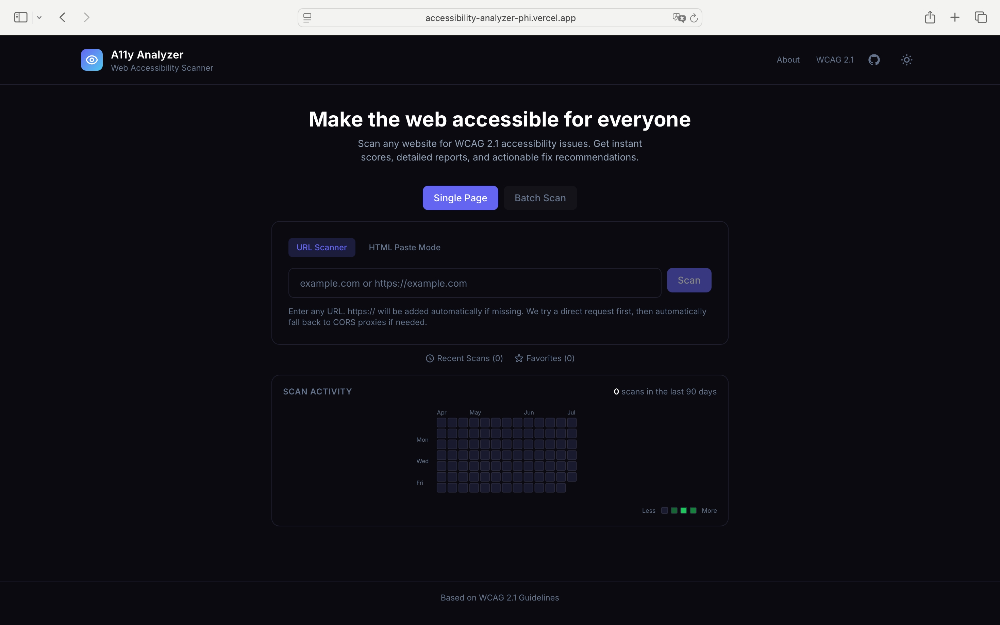
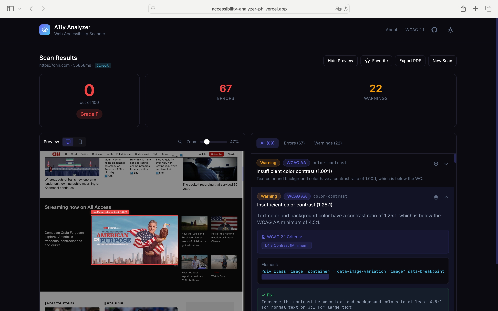
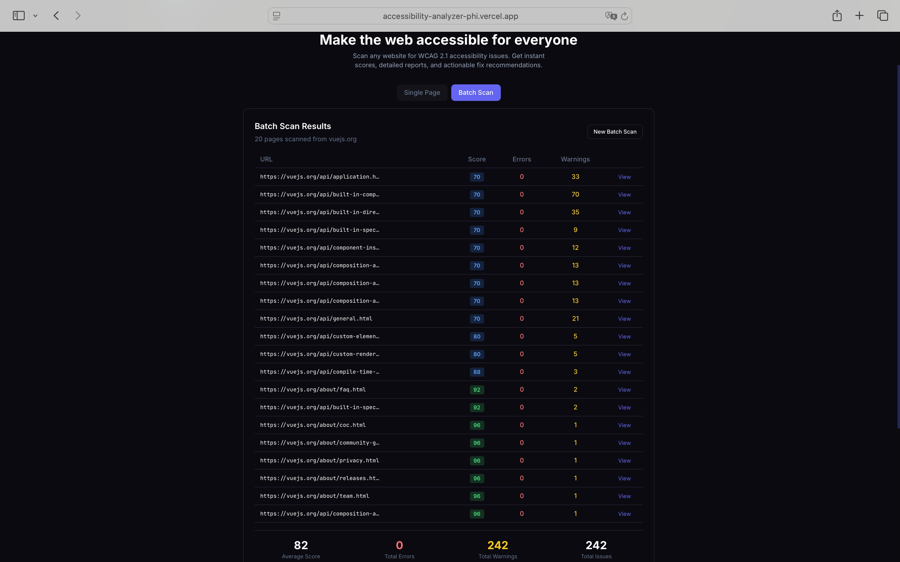
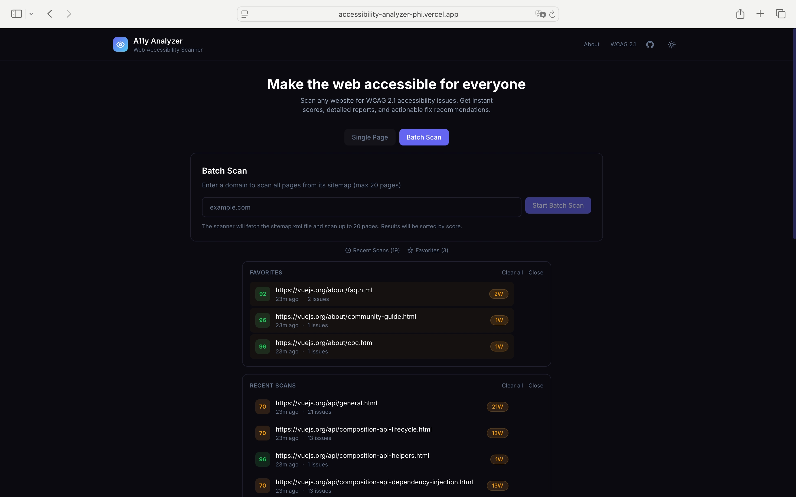

# AccessScan — Web Accessibility Scanner

> Make the web accessible for everyone. Scan any website for WCAG 2.1 issues in seconds.

Over 1.6 billion people live with a disability. Yet 96% of websites fail WCAG standards. AccessScan helps developers find and fix these issues — no installation, no dependencies, just open and scan.

**Live Demo:** [accessibility-analyzer-phi.vercel.app](https://accessibility-analyzer-phi.vercel.app)

---

## Table of Contents

- [Why Accessibility Matters](#why-accessibility-matters)
- [Features](#features)
- [Screenshots](#screenshots)
- [How It Works](#how-it-works)
- [Tech Stack](#tech-stack)
- [Getting Started](#getting-started)
- [Usage](#usage)
- [WCAG Rules Covered](#wcag-rules-covered)
- [Project Structure](#project-structure)
- [License](#license)

---

## Why Accessibility Matters

Web accessibility means building websites that everyone can use — including people with visual, motor, cognitive, or hearing disabilities. The **WCAG 2.1** standard (Web Content Accessibility Guidelines) defines what makes a site accessible, but most developers never check.

AccessScan exists to make that check effortless. Paste a URL, get an instant report, and fix issues before they exclude users.

---

## Features

### Single Page Scan

Enter any URL and get an instant accessibility score with detailed issue breakdown.

- **20 WCAG 2.1 Rules** covering images, forms, contrast, semantics, ARIA, and more
- **Live Preview** with click-to-highlight — click any issue, see the exact element on the page
- **Score System** — 0–100 score with A/AA/AAA grading
- **Export PDF** — one-click printable report with fix recommendations


### Batch Scan

Scan an entire website at once — up to 20 pages in one run.

- **Sitemap Discovery** — reads `robots.txt`, common sitemap paths, and falls back to homepage link extraction
- **Multi-Proxy Fetching** — 4 proxy strategies (self proxy, corsproxy.io, allorigins, codetabs) for maximum reach
- **Sorted Results Table** — pages ranked by score, worst first
- **Click to View** — jump into any page's full report with issues and preview


### Scan History & Favorites

- **Recent Scans** — every scan is saved locally, with one-click re-scan
- **Favorites** — star important scans for quick access
- **Scan Activity Heatmap** — GitHub-style contribution graph showing your scanning activity over 90 days
- **Score Trend per URL** — track how a page's score changes over time
- **Independent Storage** — clearing Recent Scans does not affect Activity, Favorites, or Score History


### Issue Highlighting

Click any issue in the report to highlight the problematic element directly in the live preview. Each issue includes:

- The exact HTML snippet
- A human-readable description
- WCAG criteria reference (e.g., 1.1.1 Non-text Content)
- Concrete fix recommendation with code example


---

## Screenshots

### Home Page (Initial State)



### Single Page Scan Results



### Batch Scan Results



### Favorites & Recent Scans



---

## How It Works

```
User enters URL
       │
       ▼
┌─────────────────────────┐
│  7-Layer Fetch Strategy │
│  (direct → self proxy → │
│   corsproxy → allorigins│
│   → jina.ai → codetabs  │
│   → thingproxy)         │
└────────────┬────────────┘
             │ HTML retrieved
             ▼
┌─────────────────────────┐
│  20 WCAG 2.1 Rules      │
│  (DOM-based evaluation) │
└────────────┬────────────┘
             │ Issues found
             ▼
┌─────────────────────────┐
│  Score Calculation      │
│  + Issue Report         │
│  + Live Preview         │
│  + PDF Export           │
└─────────────────────────┘
```

**Fetching:** The scanner tries a direct request first, then automatically falls back through up to 7 proxy strategies. This ensures reliable crawling even for sites with strict CORS policies.

**Rule Engine:** Each WCAG rule is a pure function that takes a parsed DOM `Document` and returns an array of `Issue` objects. Rules run independently and errors in one rule never block others.

**Batch Mode:** For multi-page scans, the system discovers URLs via `robots.txt` Sitemap directives, common sitemap paths (`/sitemap.xml`, `/sitemap_index.xml`, etc.), and homepage link extraction as a last resort.

---

## Tech Stack

| Layer | Technology | Why |
|-------|-----------|-----|
| **Framework** | React 18 + TypeScript | Type safety + component model |
| **Styling** | Tailwind CSS | Rapid UI with consistent design tokens |
| **Build** | Vite 5 | Fast dev server + optimized production builds |
| **Deploy** | Vercel (Serverless Functions) | Zero-config hosting + API proxy |
| **Storage** | Browser localStorage | No backend needed — all data stays on device |
| **Engine** | Custom DOM-based rule engine | No heavy dependencies, runs entirely client-side |

**Zero runtime dependencies** beyond React. The accessibility engine, scoring system, and rule set are all hand-built — no external a11y libraries.

---

## Getting Started

### Prerequisites

- Node.js 18+
- npm or pnpm

### Install & Run

```bash
git clone https://github.com/Thomaszhou22/accessibility-analyzer.git
cd accessibility-analyzer
npm install
npm run dev
```

Open `http://localhost:5000` in your browser.

### Production Build

```bash
npm run build
npm run preview
```

### Deploy to Vercel

The project includes `vercel.json` with API proxy configuration. Simply connect the GitHub repo to Vercel for automatic deployments.

---

## Usage

### Single Page Scan

1. Select **Single Page** mode
2. Enter a URL (e.g., `example.com`)
3. Press **Enter** or click **Scan**
4. Review the score, issue list, and live preview
5. Click any issue to highlight it in the preview
6. Click **Export PDF** for a printable report

### Batch Scan

1. Select **Batch Scan** mode
2. Enter a domain (e.g., `web.dev`)
3. Press **Enter** or click **Start Batch Scan**
4. Wait for sitemap discovery + page scanning
5. Review the results table (sorted by score, worst first)
6. Click **View** on any page to see its full report

### HTML Paste Mode

For JavaScript-rendered pages or sites behind bot detection:

1. Open the target page in your browser
2. Press `F12` → Elements → right-click `<html>` → Copy outerHTML
3. Select **HTML Paste Mode** in AccessScan
4. Paste the HTML and optionally add the source URL
5. Click **Scan HTML**

---

## WCAG Rules Covered

20 rules across 4 WCAG principle categories:

| Category | Rule ID | What It Checks |
|----------|---------|---------------|
| **Perceivable** | `img-alt` | Images missing `alt` text |
| | `color-contrast` | Insufficient text/background contrast (< 4.5:1) |
| | `media-caption` | Audio/video missing captions or transcripts |
| **Operable** | `tabindex` | Improper `tabindex` usage disrupting navigation |
| | `accesskey` | Conflicting or missing keyboard shortcuts |
| **Understandable** | `html-lang` | Missing or invalid `lang` attribute |
| | `html-title` | Missing `<title>` element |
| | `form-label` | Form inputs without associated labels |
| | `button-text` | Buttons with no accessible text |
| | `link-text` | Links with no meaningful text |
| | `empty-link` | `<a>` tags with no href or text |
| | `empty-heading` | Empty heading elements |
| | `heading-order` | Skipped heading levels (e.g., h1 → h3) |
| | `lang-valid` | Invalid language code in `lang` attribute |
| **Robust** | `duplicate-id` | Duplicate `id` attributes on one page |
| | `aria-valid` | Invalid ARIA attributes or roles |
| | `iframe-title` | `<iframe>` missing `title` attribute |
| | `meta-viewport` | Viewport meta blocking user zoom |
| | `list-structure` | Improper list markup (`<ul>`/`<ol>` without `<li>`) |
| | `table-scope` | Misuse of `scope` attribute in tables |

---

## Project Structure

```
accessibility-analyzer/
├── api/
│   └── proxy.ts              # Vercel serverless proxy (bypasses CORS)
├── src/
│   ├── engine/
│   │   ├── rules.ts          # 20 WCAG 2.1 detection rules
│   │   ├── scanner.ts        # Multi-strategy fetcher + scoring engine
│   │   └── types.ts          # TypeScript type definitions
│   ├── lib/
│   │   ├── sitemap.ts        # Sitemap discovery + link extraction
│   │   └── storage.ts        # localStorage persistence layer
│   ├── components/
│   │   ├── BatchScan.tsx     # Batch scan UI + progress
│   │   ├── Favorites.tsx     # Favorites panel
│   │   ├── IssueList.tsx     # Issue list with filtering
│   │   ├── PreviewPanel.tsx  # Live preview with highlight overlay
│   │   ├── ScanHistory.tsx   # Recent scans panel
│   │   ├── ScanInput.tsx     # URL input + mode toggle
│   │   ├── ScorePanel.tsx    # Score gauge + grade display
│   │   ├── TrendChart.tsx    # GitHub-style activity heatmap
│   │   ├── UrlScoreHistory.tsx # Per-URL score trend chart
│   │   └── ui/               # Reusable UI primitives (Button, Card, etc.)
│   ├── App.tsx               # Main app + state orchestration
│   └── index.css             # Tailwind + global styles
├── vercel.json               # Vercel config + API rewrite
├── vite.config.ts            # Vite build config
└── package.json
```

---

## License

MIT License — see [LICENSE](./LICENSE) for details.

---

> Built with the belief that the web should work for everyone.
